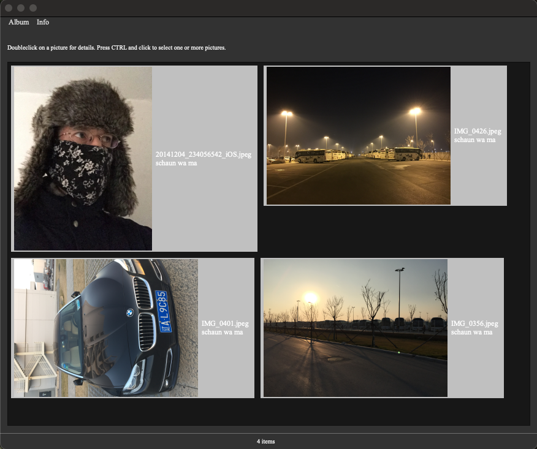
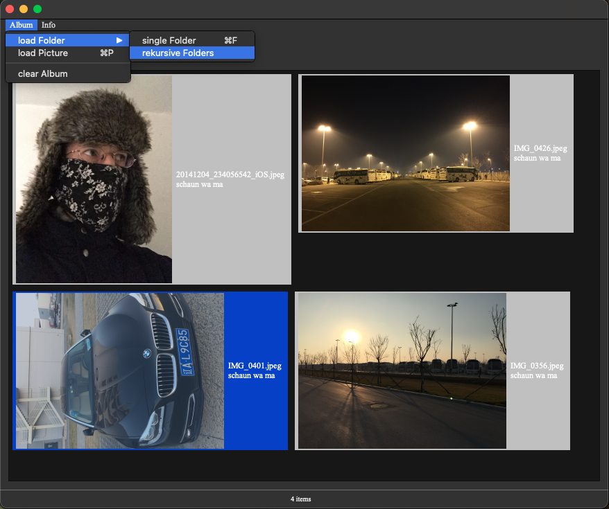
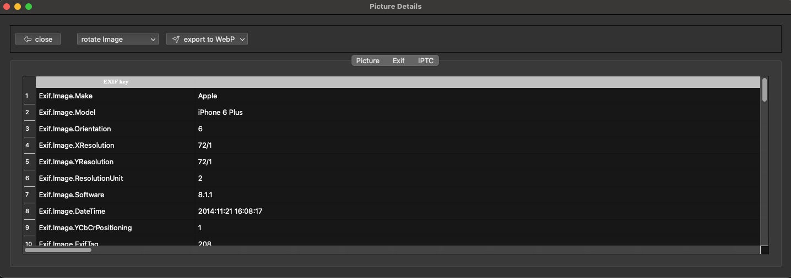
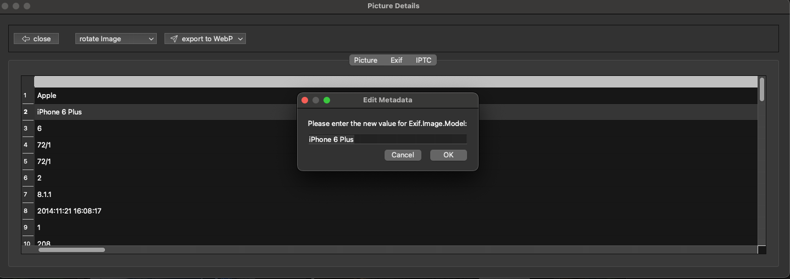
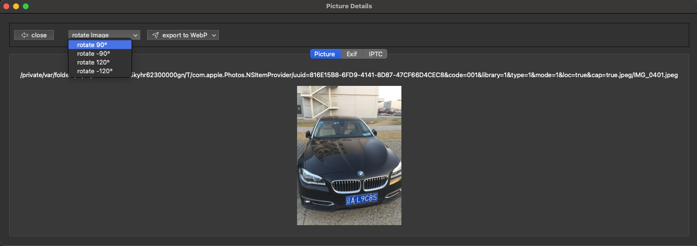
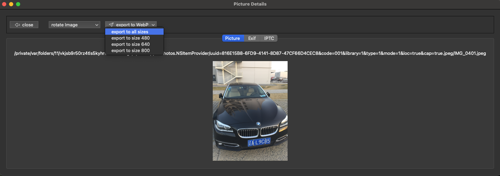

<div id="top" align="center">
<h1>qt_desktop-gallery</h1>

<p>Desktop gallery-app for Linux, MacOS, Windows to show/edit Exif/IPTC and export to WebP</p>

[Report Issue](https://github.com/Zheng-Bote/qt_desktop-gallery/issues) [Request Feature](https://github.com/Zheng-Bote/qt_desktop-gallery/pulls)

[](https://choosealicense.com/licenses/mit/)
[](https://github.com/Zheng-Bote/qt_desktop-gallery/releases)

</div>

<hr>

<!-- START doctoc generated TOC please keep comment here to allow auto update -->
<!-- DON'T EDIT THIS SECTION, INSTEAD RE-RUN doctoc TO UPDATE -->

**Table of Contents**

- [Description](#description)
  - [Features](#features)
  - [Status](#status)
    - [Application / Tool](#application--tool)
    - [Documentation](#documentation)
      - [README](#readme)
      - [other Markdown files](#other-markdown-files)
- [Installation](#installation)
  - [Dependencies](#dependencies)
  - [folder structure](#folder-structure)
  - [Usage/Examples/Tests](#usageexamplestests)
- [Documentation](#documentation-1)
  - [Screenshots](#screenshots)
- [Authors and License](#authors-and-license)
  - [License](#license)
  - [Authors](#authors)
    - [Code Contributors](#code-contributors)

<!-- END doctoc generated TOC please keep comment here to allow auto update -->

<hr>

# Description


Desktop Gallery-Application for Linux, MacOS and Windows to show/edit Exif/IPTC and export to WebP

### Features

- \[ ] advanced-super-extra-special feature xyz

  <br>

- \[x] OSS and license
- \[x] works as designed
- \[ ] no bugs

<br>

- \[x] some more or less usefull Github Actions for GH-repo, GH-pages, GH-wiki, CI/CD-Pipelines
- \[ ] Packagemanager
- \[ ] Installation routine
- \[ ] portable application

<br>

- \[x] runs on DOS/Windows
- \[x] runs on MacOS
- \[x] runs on Linux
- \[ ] runs on iOS
- \[ ] runs on Android
- \[ ] runs on HarmonyOS

<p align="right">(<a href="#top">back to top</a>)</p>

## Status

### Application / Tool


### Documentation

_see also:_ [Application Documentation](#documentation)

#### README

[](https://github.com/Zheng-Bote/qt_desktop-gallery/actions/workflows/repo-create_tree_readme.yml)
[](https://github.com/Zheng-Bote/qt_desktop-gallery/actions/workflows/repo-actions_docu.yml)

[](https://github.com/Zheng-Bote/qt_desktop-gallery/actions/workflows/repo-call_Readme.yml)

#### other Markdown files

[](https://github.com/Zheng-Bote/qt_desktop-gallery/actions/workflows/repo-create_doctoc_md.yml)

create ToC in Markdown files in folders

- .github/actions/\*\*
- .github/workflows/\*\*
- dist/\*\*
- docs/\*\*

<p align="right">(<a href="#top">back to top</a>)</p>

# Installation

bla bla ... everything easy and green with No Code/Low code and without any costs

## Dependencies

bla bla ... with a little help from my friends

## folder structure

<!-- readme-tree start -->

```
.
├── .github
│   ├── actions
│   │   └── doctoc
│   │       ├── README.md
│   │       ├── action.yml
│   │       └── dist
│   │           ├── index.js
│   │           ├── index.js.map
│   │           ├── licenses.txt
│   │           └── sourcemap-register.js
│   └── workflows
│       ├── ghp-call_Readme.yml
│       ├── ghp-create_doctoc.yml
│       ├── ghp-markdown_index.yml
│       ├── repo-actions_docu.yml
│       ├── repo-call_Readme.yml
│       ├── repo-create_doctoc.yml_
│       ├── repo-create_doctoc_md.yml
│       └── repo-create_tree_readme.yml
├── LICENSE
├── LICENSE_Apache-2
├── LICENSE_GPL-2
├── LICENSE_GPL-3
├── LICENSE_MIT
├── README.md
├── src
│   ├── CMakeLists.txt
│   ├── CMakeLists.txt.user
│   ├── includes
│   │   ├── rz_photo.cpp
│   │   └── rz_photo.hpp
│   ├── main.cpp
│   ├── mainwindow.cpp
│   ├── mainwindow.h
│   ├── mainwindow.ui
│   ├── picture_widget.cpp
│   ├── picture_widget.h
│   └── picture_widget.ui
└── tree.bak

7 directories, 32 files
```

<!-- readme-tree end -->

<p align="right">(<a href="#top">back to top</a>)</p>

## Usage/Examples/Tests

bla bla ... usage is intuitive and runs mostly automatically with no needs of any knowledge

```HTML
<mark> under construction </mark>
```

<p align="right">(<a href="#top">back to top</a>)</p>

# Documentation

see also: <https://linktodocumentation>

## Screenshots













<p align="right">(<a href="#top">back to top</a>)</p>

# Authors and License

## License

**MIT License**

[](https://choosealicense.com/licenses/mit/)

Copyright (c) 2024 ZHENG Robert

Permission is hereby granted, free of charge, to any person obtaining a copy
of this software and associated documentation files (the "Software"), to deal
in the Software without restriction, including without limitation the rights
to use, copy, modify, merge, publish, distribute, sublicense, and/or sell
copies of the Software, and to permit persons to whom the Software is
furnished to do so, subject to the following conditions:

The above copyright notice and this permission notice shall be included in all
copies or substantial portions of the Software.

THE SOFTWARE IS PROVIDED "AS IS", WITHOUT WARRANTY OF ANY KIND, EXPRESS OR
IMPLIED, INCLUDING BUT NOT LIMITED TO THE WARRANTIES OF MERCHANTABILITY,
FITNESS FOR A PARTICULAR PURPOSE AND NONINFRINGEMENT. IN NO EVENT SHALL THE
AUTHORS OR COPYRIGHT HOLDERS BE LIABLE FOR ANY CLAIM, DAMAGES OR OTHER
LIABILITY, WHETHER IN AN ACTION OF CONTRACT, TORT OR OTHERWISE, ARISING FROM,
OUT OF OR IN CONNECTION WITH THE SOFTWARE OR THE USE OR OTHER DEALINGS IN THE
SOFTWARE.

## Authors

- [](https://www.github.com/Zheng-Bote)

### Code Contributors


[](https://www.github.com/Zheng-Bote)

<hr>

:vulcan_salute:

<p align="right">(<a href="#top">back to top</a>)</p>
